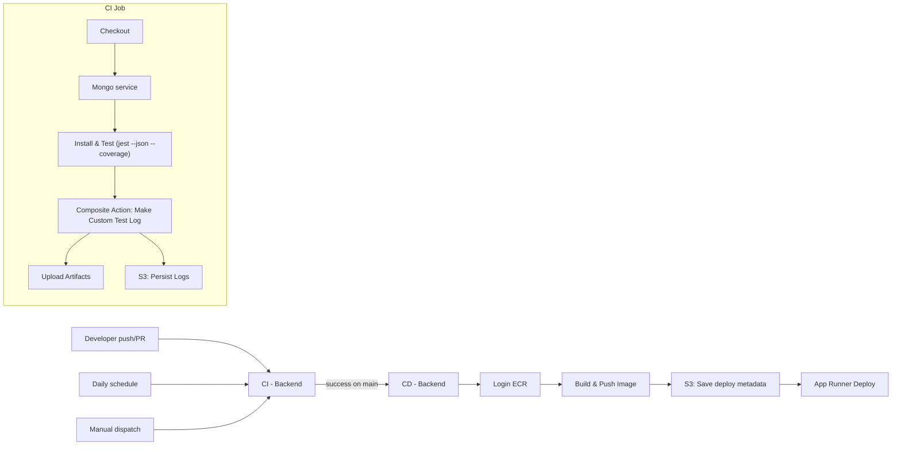
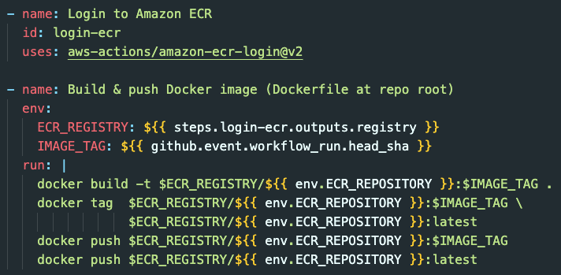
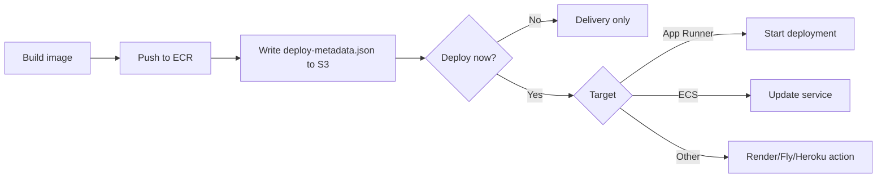

# Diploma of Web Development at CoderAcademy - Cohort October 2024

## Assignment - Develop a CI/CD Pipeline

### 15524 - Hernan Velasquez

## Prerequisites to Establish CI/CD Pipeline

- [x] AWS account in ap-southeast-2 (Sydney)
- [x] ECR repository for the backend image 
- [x] S3 bucket for persistent logs 

In GitHub repo Secrets and variables:
```AWS_ACCESS_KEY_ID```, ```AWS_SECRET_ACCESS_KEY```
```AWS_REGION``` = ap-southeast-2
```ECR_REPOSITORY``` = ECR repo name
```LOG_BUCKET``` = S3 bucket for logs

---

## Testing Requirements

For this purpose, it should be included in the ```package.json``` a CI test script that produces machine-readable results and coverage, such as:


```json
{
    "scripts": {
        "test:ci" "jest --ci --reporters=default --json --outputFile=reports/jest-results.json --coverage --coverageReporters=json-summary"    
    },
    "devDepenencies": {
        "jest": "^29.7.0"
    }
}
```

## Purpose and functionalities of the Workflow

### CI - Backend (ci-backend.yml)

- **Triggers**: `push` (main & develop), `pull_request` (to main), `schedule` (daily), and `workflow_dispatch` (manual).
-  **Services**: starts an operational MongoDB 7 container for tests.
- **Tests**: runs `npm run test:ci` to produce JSON results and coverage summary.  
- **Custom plugin**: uses the composite action `.github/actions/make-test-log` to build a human-readable `custom-test-log.txt`.
- **Persistence**: uploads artifacts and copies logs to S3 for long-term storage.
- **Failure handling**: log steps run even if tests fail; job fails at the end if tests failed.

### CD - Backend (cd-backend.yml)

- **Trigger**: `workflow_run` runs automatically when the **CI - Backend** is successfully completed on the **main** branch.
- Builds and pushes a Docker image to the Elastic Container Repository (ECR), tags it as `latest`and commit-SHA.
- **Preserves deployment revision**: stores a `deploy-metadata.json` record in S3
- **Deploys**: triggers **App Runner** to deploy. In this case, the workflow is defined for future use but is not currently active to avoid incurring costs during this exercise.

### Tools -  Export Workflow Files (tools-export-workflows.yml)
- **Triggers**: manual and weekly schedule.
- Zips `.github/workflows` and uploads as an artifact so the exact YAMLs used in the repo are downloadable.

### Sanity Test for Credentials (sanity-aws-creds.yml)

Checks the AWS credentials:
- **Verify**: GitHub Actions can authenticate to AWS with secrets, the IAM is authorised and the S3 log bucket is accessible.

## Architecture Diagrams

### CI/CD Flow


### Runtime Architecture (Backend)

```mermaid
flowchart TB
  client[Frontend / API Client] --> apprunner[App Runner Service]
  apprunner --> ecr[ECR Image]
  apprunner --> atlas["MongoDB (Atlas or managed DB)"]
  ```

## Services & Technologies Used in This Project - Alternatives

### GitHub Actions (CI/CD engine)
**Why**: native to GitHub, huge marketplace, good developer tools.
Tool used to trigger `push` to `main/develop`, `pull_request` to `main`, `schedule` (every day 18:00 UTC), `workflow_dispatch` (manual), `workflow_run`

```yaml

on:
  push:
    branches: [ main, develop ]
    paths:
      - 'src/**'
      - '__tests__/**'
      - 'package.json'
      - 'package-lock.json'
      - 'Dockerfile'
      - '.github/workflows/ci-backend.yml'
      - '.github/actions/make-test-log/**'
  pull_request:
    branches: [ main ]
    paths:
      - 'src/**'
      - '__tests__/**'
      - 'package.json'
      - 'package-lock.json'
      - 'Dockerfile'
  schedule:
    - cron: '0 18 * * *'   # 18:00 UTC daily
  workflow_dispatch:
  ```
*Example of Actions performed by workflows*

**Alternatives (trade-offs):**
|Engine             | Pros                                                            | Cons / When not to                                            |
| ------------------ | --------------------------------------------------------------- | ------------------------------------------------------------- |
| **GitHub Actions**[^1],[^3] | Tight GitHub integration, huge catalog of actions, easy secrets | Runner minutes can cost; advanced self-hosting requires setup |
| GitLab CI          | Excellent if you’re on GitLab, built-in container registry      | Migration friction if repo is on GitHub                       |
| CircleCI[^1]          | Nice UX, fast pipelines, orbs                                   | External to repo, pricing at scale                            |
| Jenkins[^1]            | Infinite flexibility, self-host                                 | You manage infra, plugins, security/hardening                 |


*References:* Coder Academy, 2025 [^1], AWS, 2025 [^2] ,GitHub Docs, 2025 [^3]

### Test stack: Node + Jest + Supertest + MongoDB service
**Why:** *Jest* runs unit/integration tests; *Supertest* call the Express app directly (no ports), CI starts a *MongoDB 7* as a service container.
With this it is possible to generate `reports/jest-results.json` (machine-readable), `custom-test-log.txt` and `coverage/** (JSON summary).
Also, **S3** is used so logs survive beyond artifact retention

```mermaid
sequenceDiagram
  participant GA as GitHub Actions (CI)
  participant M as MongoDB service
  participant APP as Express app (tests)
  participant S3 as Amazon S3

  GA->>M: Start mongo:7 service
  GA->>APP: npm ci & jest --ci
  APP->>M: Connect (mongoose)
  APP-->>GA: Test results (stdout + json)
  GA->>S3: Upload test logs and coverage
```

**Alternatives (trade-offs):**
- **Vitest** might be faster and it works great with ESM (Vitest, 2025)[^4], **Mocha and Chai** are classic but with slower execution (Medium, 2025)[^5]
-  **MongoDB Atlas** has a cost associated

### Docker & container registry (ECR)
**Why**: allows to build a Node/Express container from a `Dockerfile`, tag images as `latest`, the commit SHA for traceability and push to Amazon ECR (regional, fast pulls for AWS)


*Actions to Login to ECR, build and push*

**Alternatives (registries)**: Docker Hub has a public/limited rate on how many image pulls can be done in a timeframe (Docker, 2025)[^6]. However there are other alternatives without mayor differences: GHCR, GCP/Azure and alternative build systems as Buildpacks (Paketo/Heroku) for "Docker-less" (Devtron, 2024)[^7]

### S3 for Logs/Artifacts & Deployment Revisions
**Why**: cheap, durable and it has a long retention of logs. Github artifacts expire but S3 does not — unless the lifecycle is predefined by the user.

**Alternatives**:

| **Need**                 | **Option**                | **Notes**                                     |
| -------------------- | --------------------- | ----------------------------------------- |
| **Long-term logs**       | **S3**                | Simple & cheap; you can query with Athena[^8] |
| **Streaming logs**       | CloudWatch Logs   | Great for app runtime logs and metrics[^9]    |
| **Short-term artifacts** | Actions Artifacts | Easy but expires (default 90 days)        |
| **Log stacks**           | ELK / Loki+Grafana[^10]    | Powerful queries; more infrastructure to run       |


*References:* AWS, 2025[^8], AWS, 2025[^9], Opsverse, 2024[^10]

### (Optional) Deploy Platform: App Runner vs ECS and others
This project is not using the App Runner right now, to avoid unexpected costs, but the pipeline still delivers to ECR and records revisions.

In case that a runtime is desired, the next details can be considered:

| Platform                 | Best for              | Pros                                               | Cons                                         |
| ------------------------ | --------------------- | -------------------------------------------------- | -------------------------------------------- |
| **AWS App Runner**       | Simple container apps | Zero infrastructure, auto-deploy from ECR, HTTPS by default[^11] | Less control than ECS; regional availability |
| **AWS ECS Fargate**      | Fine-grained control[^12]  | VPC control, autoscaling, task roles               | More setup (task defs, ALB, etc.)            |
| **Render / Fly.io / Heroku** | Fast Developer Experience thanks to intuitive UI[^13]               | Super simple, free tiers sometimes                 | Vendor lock-in, limits on customization      |


*References:* AWS, 2025[^11], AWS, 2024[^12], Render, 2025[^13]



*Delivery decision (no runtime now, but future-proof)*


## References

[^1]: Coder Academy, 2025, *Introduction to Continuos Integration Pipelines*, accessed on 22 August 2025, https://edstem.org/au/courses/24239/lessons/83128/slides/566719

[^2]: AWS, 2025, *Amazon Elastic Container Registry pricing*, accessed on 18 August 2025, https://aws.amazon.com/ecr/pricing/

[^3]: GitHub Docs, 2025, *Working with the Container registry*, accessed on 18 August 2025, https://docs.github.com/en/packages/working-with-a-github-packages-registry/working-with-the-container-registry

[^4]: Vitest, 2025, *Features*, accessed on 18 August 2025, https://vitest.dev/guide/features.html

[^5]: Medium, 2025, *Testing with Mocha and Chai*, accessed on 18 August 2025, https://medium.com/spidernitt/testing-with-mocha-and-chai-b8da8d2e10f2

[^6]: Docker, 2025, *What is a registry?*, accessed on 18 August 2025, https://docs.docker.com/get-started/docker-concepts/the-basics/what-is-a-registry/

[^7]: Devtron, 2024, *Dockerfile vs Buildpacks: Which One to Choose?*, accessed on 19 August 2025, https://devtron.ai/blog/dockerfile-vs-buildpacks-which-one-to-choose/

[^8]: AWS, 2025, *Amazon Athena*, accessed on 18 August 2025, https://aws.amazon.com/athena/#:~:text=Amazon%20Athena%20is%20an%20interactive,your%20query%20needs%20to%20run.

[^9]: AWS, 2025, *What is Amazon CloudWatch Logs?*, accessed on 22 August 2025, https://docs.aws.amazon.com/AmazonCloudWatch/latest/logs/WhatIsCloudWatchLogs.html

[^10]: Opsverse, 2024, *Grafana Loki vs ELS Stack for Logging, A Comprehensive Comparison*, accessed on 20 August 2025, https://docs.aws.amazon.com/AmazonCloudWatch/latest/logs/WhatIsCloudWatchLogs.html

[^11]: AWS, 2025, *App Runner service based on a source image*, accessed on 20 August 2025, https://docs.aws.amazon.com/apprunner/latest/dg/service-source-image.html

[^12]: AWS, 2024, *AWS Fargate or AWS Lambda?*, accessed on 20 August 2025, https://docs.aws.amazon.com/decision-guides/latest/fargate-or-lambda/fargate-or-lambda.html

[^13]: Render, 2025, *Render vs Heroku*, accessed on 20 August 2025, 
https://render.com/docs/render-vs-heroku-comparison